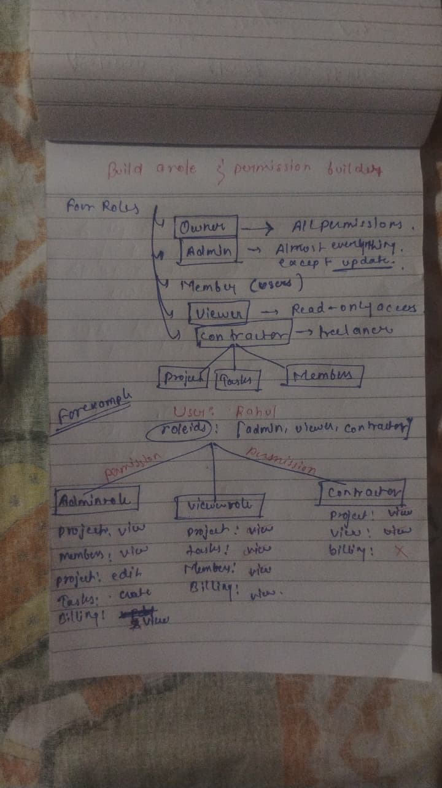
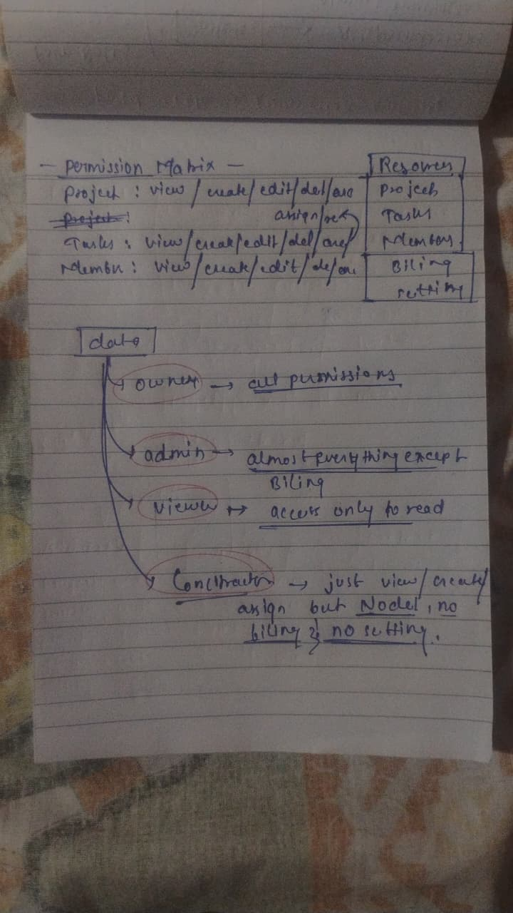
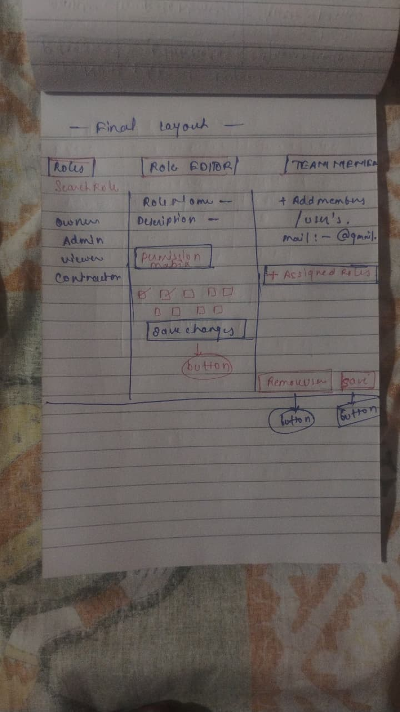

# 🚀 Workbench – Role & Permission Builder

A full-stack **Role & Permission Builder** built for the Workbench SaaS platform.

This application enables administrators to create custom roles, assign permissions, manage team members, and calculate effective permissions when users have multiple roles.

---

## 🌐 Live Demo

**Application:** https://workbench-rbac-mocha.vercel.app/

---

## ✨ Features

- ✅ Create custom roles
- ✅ Edit existing roles
- ✅ Delete custom roles
- ✅ Permission Matrix (19 predefined permissions)
- ✅ Assign roles to team members
- ✅ Remove roles from team members
- ✅ Effective Permission Resolution (UNION strategy)
- ✅ Add new team members
- ✅ Delete team members
- ✅ Responsive SaaS Dashboard
- ✅ Modern UI with Drawer, Toasts & Confirmation Modals

---

## 🛠 Tech Stack

| Technology | Purpose |
|------------|---------|
| Next.js 15 | Frontend + API Routes |
| TypeScript | Type Safety |
| Tailwind CSS | Styling |
| React | UI |
| In-Memory Store | Data Storage |

---

# 📸 Design & Planning

Before starting the implementation, I first designed the application's architecture, role hierarchy, permission model, and user flow on paper. This helped me define the data model and overall workflow before writing code.

## Initial Role & Permission Planning



---

## Permission Matrix & Data Modeling



---

## Final UI Layout



# 🔐 Permission Resolution

This project follows the **UNION** permission strategy.

When a user has multiple roles, all unique permissions from those roles are combined.

### Example

Role A

```
projects:view
projects:create
```

Role B

```
projects:edit
tasks:view
```

Effective Permissions

```
projects:view
projects:create
projects:edit
tasks:view
```

---

# 📂 Project Structure

```
workbench-rbac
│
├── app
│   ├── api
│   ├── layout.tsx
│   ├── page.tsx
│   └── globals.css
│
├── components
│   ├── layout
│   ├── roles
│   ├── users
│   └── ui
│
├── data
│
├── lib
│
├── public
│   └── screenshots
│
├── types
│
├── Architecture.md
└── README.md
```

---

# 🚀 Getting Started

Clone the repository

```bash
git clone https://github.com/skshukla29/workbench-rbac.git
```

Move into the project

```bash
cd workbench-rbac
```

Install dependencies

```bash
npm install
```

Run the development server

```bash
npm run dev
```

Open your browser

```
http://localhost:3000
```

---

# 📄 Architecture

For implementation details and design decisions, see:

```
Architecture.md
```

---

# 🎯 Assignment Scope

Implemented features:

- Role Management
- Permission Matrix
- User Management
- Role Assignment
- Effective Permission Resolution
- Responsive Dashboard
- Team Member Drawer
- Add/Delete Member
- Toast Notifications
- Confirmation Dialogs

---

# 👨‍💻 Author

**Shashikant**

Built as part of the **Software Development Engineer Intern Assignment** for **The Internet Folks**.